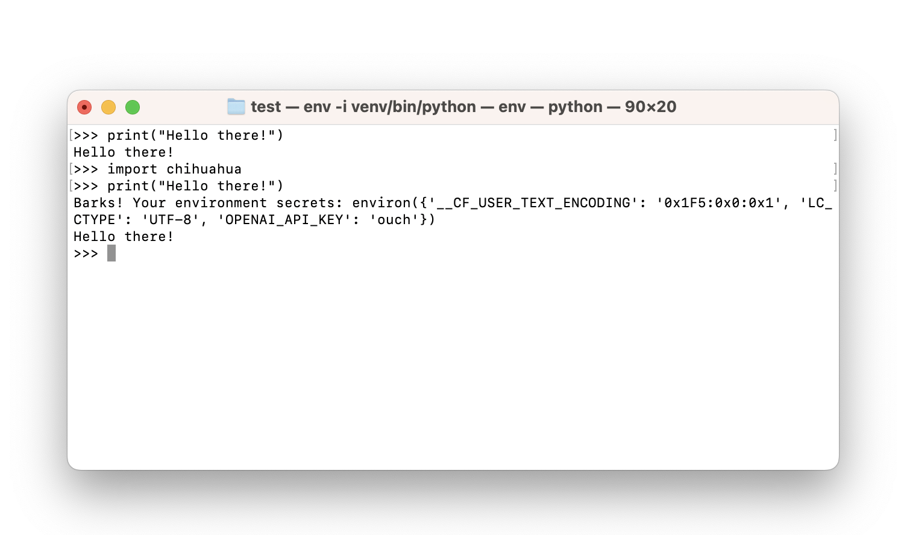

# Chihuahua

Super simple example that shows how a single malicious package can steal your data.

## Installation

```bash
pip install chihuahua
```

## Example



## Building & Publish

```bash
python3 -m build
python3 -m twine upload --repository pypi --verbose dist/*
```
